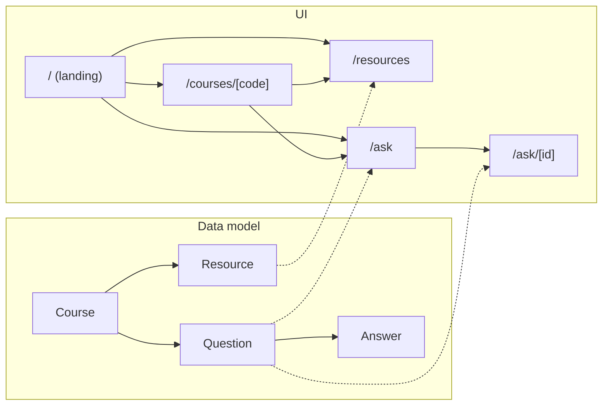

# Architecture

## The one idea this app is built around

"Ask a senior" and "Share resources" look like two features. Underneath,
they're the same shape: **content, scoped to a course, contributed by a
student.** So instead of building two disconnected mini-apps, both features
sit on one shared `Course` backbone. A course hub page
(`/courses/[code]`) shows both side by side — that's not a design flourish,
it's the actual architecture made visible.

## Components (what shows)

`src/components/` holds only display logic — no direct file access, no
business rules:

- `Header` / `IdentityBadge` — the name + role picker, always visible.
- `CourseBadge` / `CourseFilterRow` — the course is the organizing unit
  everywhere, so this is reused on the homepage, `/resources`, and `/ask`.
- `ResourceCard`, `QuestionCard` — read-only display of one item.
- `ResourceForm`, `QuestionForm`, `AnswerForm` — client components that
  `POST` to the API routes, then call `router.refresh()` so the server
  component above them re-fetches fresh data. No client-side cache to keep
  in sync — the server is the source of truth on every navigation.

## Logic + data (what thinks)

`src/lib/` is the only code allowed to touch the data file:

- `types.ts` — the shared shape (`Course`, `Resource`, `Question`, `Answer`).
- `db.ts` — every read and write goes through here. Pages call
  `getCourses()`, `listResources()`, etc. directly (they're server
  components, so this runs on the server with zero network round trip).
  API routes call the `add*` functions when a form submits.
- `seed.ts` — the starting data, so the app isn't empty for screenshots.
- `utils.ts` — pure functions only (`formatRelativeTime`,
  `isValidCourseCode`, `sortByNewest`, `initials`). Kept separate from
  `db.ts` on purpose: pure functions are what `tests/` actually tests.
- `identity.tsx` — who you're currently signed in as. Lives in the browser
  only (see `docs/decisions.md` for why there's no real login).

## Request flow, end to end

1. A server component (e.g. `app/courses/[code]/page.tsx`) calls
   `getCourse()`/`listResources()`/`listQuestions()` from `lib/db.ts`
   directly during render. No `fetch`, no API round trip — it's all one
   process.
2. A form is a client component. Submitting it does a real `fetch()` to an
   API route under `app/api/`.
3. The API route validates input, calls the matching `add*` function in
   `lib/db.ts`, and returns the created record.
4. The form calls `router.refresh()`, which re-runs the server component
   above it — so the new resource/question/answer shows up without a full
   page reload or any client-side state to manage.

## Where the data actually lives

`data/db.json`, a single JSON file, read and written by `lib/db.ts`. It's
seeded from `lib/seed.ts` the first time the app runs and gitignored after
that — every clone starts from the same seed data. See
`docs/decisions.md` for why this is a file instead of a database.
